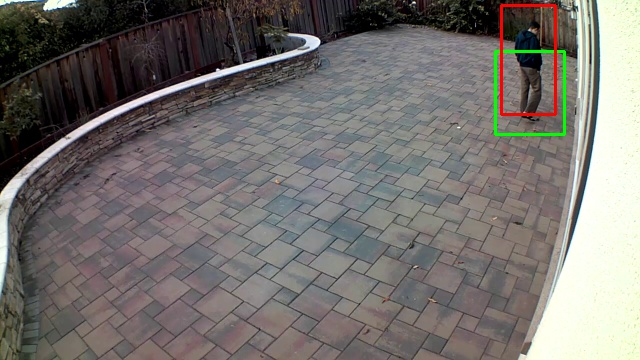
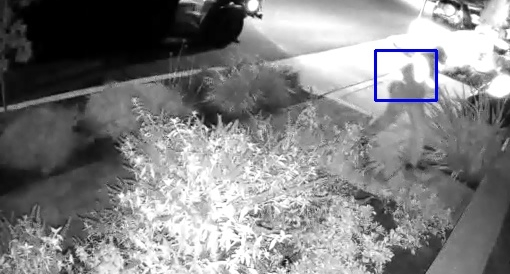

# Blink Camera Vision

For owners of [Blink XT camera](https://blinkforhome.com/), this program aims to simplify the task sifting thru all the video captures, detect frames that contain humans, and save them as pictures on your hard drive.

## Fully automated process to perform the following:
- Download own mp4 videos from Blink web-service
    * Save them to local hard drive in neatly dated folders
- Using computer vision, detect humans in mp4 videos
    * Draw a box around the frames, and save them as JPEG files

 
Night shot in the dark with Blink infrared night vision. Foreground was completely dark:
 

A simple python API to perform other Blink Camera management tasks such as check power status, connectivity, etc is also included.

## How to run
Recommend Python 3.7 virtual environment with [requirements.txt](./requirements.txt) installed. Used on Centos 7 Linux.

To run:

    python blink_cron.py video_dl_loop --user=YourBlink@user.acct --pwd=YourBlinkPassword --seconds=450 --limit-size=100 --fldr=/path/to/my/storage

The above command will execute a loop that:
* Using the user/pwd, log to Blink servers and list all available mp4 videos
* Download all videos that are not available locally in `/path/to/my/storage/blink`
* For newly downloaded videos, select maximum of `100` videos. For each video:
    * Loop thru the video frame-by-frame and select 1 frame out of every 15 frames
    * Using OpenCV (computer vision) package:
      - Detect human body (full body, upper body, lower body - [Haar Cascade](https://docs.opencv.org/3.4/d7/d8b/tutorial_py_face_detection.html) classifier)
      - If human body is detected:
          - draw boxes around where the body is detected
          - Save the frame as JPEG File in `/path/to/my/storage/extract-blink`
* Keep repeating the loop until `450` seconds have elapsed since launch time

Run the above as a CRON JOB on a cloud server, and expose parts of /path/to/my/storage via HTTPS(auth) and videos/pictures can be viewed by any web browser. Or just attach new JPEGs and send them as email attachment to yourself. Supports multi-CPU parallel processing.
Alternatively, run serverless/lambda functions and save it all to cloud. The OpenCV parts could take 100-150 seconds to run for each mp4.

When running unattended, errors may occur. If you would like to be notified by email, set the following environment variables and launch the above with an additional parameter `--smtp=True`

    SMTP_HOST=smtp.gmail.com # any SMTP server of yours
    SMTP_PORT=587 # or 465?
    SMTP_AUTH_USER=your-smtp-auth-username
    SMTP_AUTH_PASSWORD=your-smtp-auth-pwd
    SMTP_FROM_ADDR=blink-server@your-sender-email
    SMTP_TO_ADDR=customer@your-email.addr

#### Just want to use the python API to Blink?
    from cameras.blink_api import BlinkApi
    x = BlinkApi()
    x.login('YourBlink@user.acct', 'YourBlinkPassword')
    x.dl_all_videos('/path/to/my/storage')
    # All mp4 videos will be downloaded to: /path/to/my/storage/blink/<acct>/<sync-device>/<camera-id>

    # or simply call the following polite API that 
    # will not call Blink until your wait 90 seconds between successive downloads
    
    from blink_dl import polite_dl_blink_videos
    polite_dl_blink_videos('YourBlink@user.acct', 'YourBlinkPassword', '/path/to/my/storage')

### Inspiration
Blink XT is great camera. However it triggered too many false positives. It was not feasible to daily go thru all videos on an app - just trying to detect suspicious people. So this program was created out of necessity.

### Future development: _Unlikely :)_
While this app is fully functional, it is very much an un-polished prototype. Code is not robust.
Beyond the current version (December 2018), the author does not plan on maintaining the codebase or participating actively.
By releasing it here, the author hopes others would fork it, and improve it.

__Note to Blink team: Consider releasing an official API.__

### Disclaimer:
This project or its author have no relationship Blink, Immedia Semiconductor Inc, Amazon or any of their affiliates.
The author is a consumer of Blink camera, and created this app out of necessity to manage own camera.

The app is put together using various bits and pieces of code/information found on the web. 
**See** [credits.md](./credits.md)

Since these are not officially published, the author *DOES NOT RECOMMEND THAT YOU USE THEM*. By using the API, you may be violating some terms/laws and/or voiding your warranty (author has not looked into this).

#### Please do not overburden Blink APIs.
